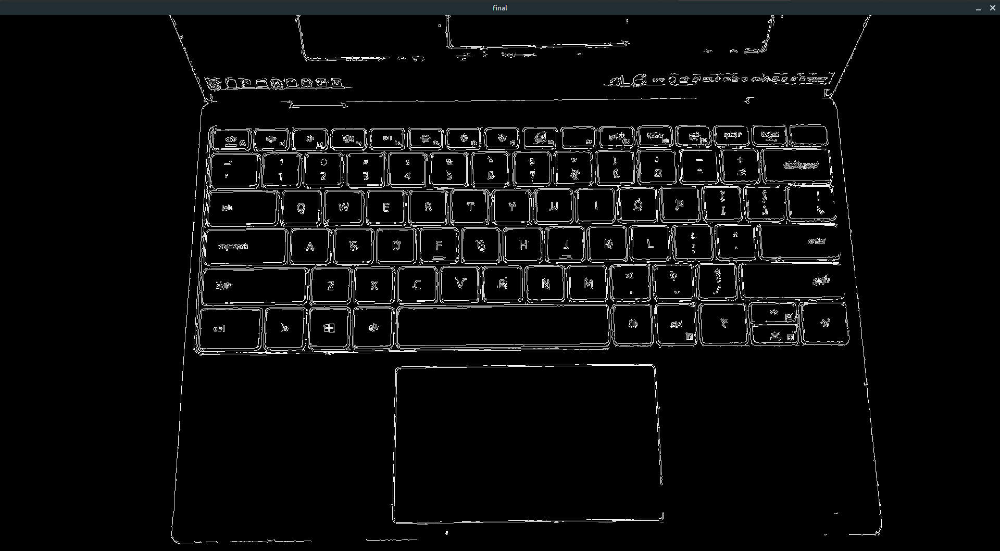

# CPP CV

A series of low level computer vision algorithms rewritten in C++ that can be applied on live streamed images from a
linked phone application.

### Example: Canny Edge Detection

OpenCV
```cpp
cv::Canny(src, dst, 100, 200)
```


CPP CV
```cpp
Sobel(grayscale, mag, phase);
NMS(mag, phase);
auto q = DoubleThresholding(mag, 0.4, 0.8);
Hysteresis(mag, q);
cv::threshold(mag, mag, 100, 1, cv::THRESH_BINARY);
```


### Implemented Algorithms

- Gaussian Blur
- Sobel Filter
- Canny Edge Detection

## Installation / Development

### Dependencies

Prior to building the project, install dependencies for ZeroMQ and OpenCV.

(Currently only linux installation is supported, but other operating systems should work with the proper dependencies)

#### Linux

##### Install dependencies

`sudo apt install libzmq3-dev libopencv-dev`

##### Build project

`cmake --build .`

##### Run project

Execute the generated executable with `./videostreamserver`

This will bind a socket to the port 8001, which can then communicate with the corresponding phone camera using the
videostreamclient application. (Both devices must be connected to the same local network and must be able to
communicate)